# FM Benchmark Submission Guide

Welcome! This guide explains how to submit your Foundation Model's evaluation results to the leaderboard.

---

## 🔄 How it works (fully automated)

Our submission pipeline is **fully automated** — your results appear on the leaderboard within minutes, not days.

```mermaid
flowchart TB
    subgraph local ["🖥️ Your Machine"]
        A["1. Run fmbench locally"] --> B["2. Get eval.yaml"]
    end
    
    subgraph submit ["📤 Submit"]
        B --> C["3. Open GitHub Issue"]
        C --> D["4. Paste eval.yaml"]
    end
    
    subgraph auto ["🤖 Automated (GitHub Actions)"]
        D --> E["5. Bot validates YAML"]
        E --> F["6. Commits to evals/"]
        F --> G["7. Rebuilds leaderboard"]
        G --> H["8. Deploys to Pages"]
    end
    
    H --> I["🎉 Live on leaderboard!"]
    
    style local fill:#e8f5e9,stroke:#4caf50
    style submit fill:#fff3e0,stroke:#ff9800
    style auto fill:#e3f2fd,stroke:#2196f3
```



!!! success "No manual review required"
    The bot validates your submission automatically. If the YAML is valid, it's added immediately. If there's an error, you'll get feedback in the issue comments.

---

## Quick Start

### Option 1: Use the CLI + GitHub Issue (Recommended)

```bash
# 1. Clone and install
git clone https://github.com/allison-eunse/ai4h-inspired-fm-benchmark-hub.git
cd ai4h-inspired-fm-benchmark-hub
pip install -e .

# 2. Generate toy data for testing
python -m fmbench generate-toy-data

# 3. Run your model
python -m fmbench run \
    --suite SUITE-TOY-CLASS \
    --model path/to/your_model_config.yaml \
    --out results/my_model_run

# 4. Submit via GitHub Issue (attach eval.yaml)
```

Submit here:

[Open a pre-filled submission issue](https://github.com/allison-eunse/ai4h-inspired-fm-benchmark-hub/issues/new?template=benchmark_submission.md){ .md-button .md-button--primary }

---

### Option 2: Manual YAML Submission (Pull Request)

Create evaluation YAML files manually and submit via PR.

---

## Step-by-Step Guide

### 1. Create Your Model Configuration

Create a YAML file in `configs/` describing your model:

```yaml
# configs/model_my_awesome_fm.yaml
model_id: my_awesome_fm
name: "My Awesome Foundation Model"
version: "1.0.0"

# How to load the model
type: python_class
import_path: "my_package.models:MyModel"
init_kwargs:
  checkpoint: "path/to/checkpoint.pt"
  
# Metadata
modality: ["fMRI", "EEG"]  # or "genomics", "MRI"
paper: "https://arxiv.org/abs/xxxx.xxxxx"
code: "https://github.com/my-org/my-model"
license: "MIT"
```

### 2. Run Evaluation

#### Classification Task

```bash
python -m fmbench run \
    --suite SUITE-NEURO-CLASS-001 \
    --model configs/model_my_awesome_fm.yaml \
    --out results/my_fm_neuro
```

#### Robustness Evaluation

```bash
python -m fmbench run-robustness \
    --model configs/model_my_awesome_fm.yaml \
    --data toy_data/neuro/robustness \
    --out results/my_fm_robustness
```

### 3. Review Your Results

Check the generated files:

```
results/my_fm_neuro/
├── eval.yaml      # Evaluation record (submit this!)
└── report.md      # Human-readable report
```

---

## What to submit (minimum required)

To get onto the leaderboard, you only need to submit **one file**: your `eval.yaml`.

Minimum required fields (anything else is optional but encouraged):

- **`eval_id`**: unique run identifier
- **`benchmark_id`**: must match an existing benchmark in `benchmarks/`
- **`model_ids.candidate`**: your model ID (string)
- **`dataset_id`**: dataset identifier used for the run
- **`run_metadata`**: at least `runner`, plus hardware/runtime if available
- **`metrics`**: task-appropriate metrics (e.g., `AUROC`, `Accuracy`, robustness rAUCs)
- **`status`**: `Completed` (or explain failures)

Minimal example:

```yaml
eval_id: SUITE-TOY-CLASS-my_model-2025-12-18-120000
benchmark_id: BM-TOY-CLASS
model_ids:
  candidate: my_model_id
dataset_id: DS-TOY-FMRI-CLASS
run_metadata:
  date: "2025-12-18"
  runner: fmbench
  suite_id: SUITE-TOY-CLASS
  hardware: "1x A100 40GB"
  runtime_seconds: 123.4
metrics:
  AUROC: 0.82
  Accuracy: 0.76
status: Completed
```

What a “good” submission includes (recommended):

- **Exact command + config** used (`suite_id`, `model_config`, `output_dir`)
- **Robustness metrics** when applicable (`dropout_rAUC`, `noise_rAUC`, etc.)
- **Stratified metrics** under `metrics.stratified` (site/sex/age_group/etc.)
- Optional: attach `report.md` for quick human review

### 4. Submit via Pull Request

1. **Fork** the repository
2. **Add** your files:
   - `configs/model_your_model.yaml` - Model configuration
   - `evals/YOUR_EVAL_ID.yaml` - Evaluation results
   - (Optional) `models/your_model.yaml` - Detailed model metadata
3. **Create PR** with title: `[Submission] Your Model Name - Benchmark Name`

---

## Evaluation YAML Format

Your `evals/*.yaml` file should follow this format:

```yaml
# evals/SUITE-NEURO-CLASS-my_fm-20240101-120000.yaml
eval_id: SUITE-NEURO-CLASS-my_fm-20240101-120000
benchmark_id: BM-001  # Must match existing benchmark

model_ids:
  candidate: my_awesome_fm

dataset_id: DS-ADNI  # Or your dataset

run_metadata:
  date: "2024-01-01"
  runner: "fmbench"
  hardware: "NVIDIA A100 80GB"
  runtime_seconds: 3600

# Overall metrics
metrics:
  AUROC: 0.92
  Accuracy: 0.88
  F1-Score: 0.87
  
  # Stratified metrics (for granular leaderboards)
  stratified:
    scanner:
      Siemens:
        AUROC: 0.94
        Accuracy: 0.90
        N: 150
      GE:
        AUROC: 0.89
        Accuracy: 0.85
        N: 120
      Philips:
        AUROC: 0.91
        Accuracy: 0.87
        N: 100
    
    acquisition_type:
      resting_state:
        AUROC: 0.93
        Accuracy: 0.89
        N: 200
      task_based:
        AUROC: 0.90
        Accuracy: 0.86
        N: 170
    
    site:
      Site_A:
        AUROC: 0.92
        N: 100
      Site_B:
        AUROC: 0.91
        N: 120

status: Completed
```

---

## Stratification Categories

To appear in granular sub-leaderboards, include these stratified metrics:

### For fMRI/Neuro

| Category | Values |
|----------|--------|
| `scanner` | Siemens, GE, Philips |
| `acquisition_type` | resting_state, task_based, naturalistic |
| `field_strength` | 1.5T, 3T, 7T |
| `preprocessing` | fmriprep, hcp, conn, minimal |
| `site` | Your site names |

### For Genomics

| Category | Values |
|----------|--------|
| `sequencing_platform` | Illumina, PacBio, ONT |
| `cell_type` | T-cell, B-cell, Monocyte, etc. |
| `tissue` | Blood, Brain, Liver, etc. |

### For All Benchmarks

| Category | Values |
|----------|--------|
| `sex` | M, F |
| `age_group` | age_20-40, age_40-60, age_60-80, age_80-100 |
| `disease_stage` | CN, MCI, AD, etc. |
| `ethnicity` | Your categories |

---

## Report Quality Metrics (for Generation Tasks)

If your model generates reports/text, include these metrics:

```yaml
metrics:
  # Linguistic
  bleu: 42.5
  rouge_l: 0.68
  bertscore: 0.89
  
  # Clinical
  clinical_accuracy: 0.92
  finding_recall: 0.88
  finding_precision: 0.91
  hallucination_rate: 0.05  # Lower is better
  omission_rate: 0.08       # Lower is better
  
  # Aggregate
  report_quality_score: 0.87
```

---

## Robustness Metrics

For robustness evaluations, include:

```yaml
metrics:
  robustness_score: 0.78
  dropout_rAUC: 0.82
  noise_rAUC: 0.75
  line_noise_rAUC: 0.80
  perm_equivariance: 0.85
  shift_sensitivity: 0.79
  
  # For genomics
  masking_rAUC: 0.77
  expression_rAUC: 0.81
```

---

## PR Checklist

Before submitting, ensure:

- [ ] Model config YAML is valid
- [ ] Eval YAML has correct `benchmark_id`
- [ ] Metrics include both overall and stratified results
- [ ] All required metadata is present
- [ ] Results are reproducible (include seed if applicable)

---

## Questions?

- Open an [Issue](https://github.com/allison-eunse/ai4h-inspired-fm-benchmark-hub/issues)
- Check existing [Discussions](https://github.com/allison-eunse/ai4h-inspired-fm-benchmark-hub/discussions)

Thank you for contributing to open FM benchmarking! 🎉

