# How It Works

This page explains the end-to-end flow from running a benchmark to appearing on the leaderboard.

---

## The Big Picture

```mermaid
flowchart LR
    subgraph you ["👤 You"]
        A["Run benchmark\nlocally"]
    end
    
    subgraph artifacts ["📦 Artifacts"]
        B["eval.yaml"]
        C["report.md"]
    end
    
    subgraph submit ["📤 Submit"]
        D["GitHub Issue"]
    end
    
    subgraph automation ["🤖 GitHub Actions"]
        E["Validate"]
        F["Commit"]
        G["Build"]
        H["Deploy"]
    end
    
    subgraph result ["🏆 Result"]
        I["Live Leaderboard"]
    end
    
    A --> B
    A --> C
    B --> D
    D --> E
    E --> F
    F --> G
    G --> H
    H --> I
    
    style you fill:#e8f5e9,stroke:#4caf50
    style artifacts fill:#fff3e0,stroke:#ff9800
    style submit fill:#e1f5fe,stroke:#03a9f4
    style automation fill:#f3e5f5,stroke:#9c27b0
    style result fill:#fce4ec,stroke:#e91e63
```



---

## Step-by-Step

### 1️⃣ Run locally (your machine)

```bash
python -m fmbench run \
    --suite SUITE-GEN-CLASS-001 \
    --model configs/model_geneformer.yaml \
    --dataset DS-PBMC \
    --out results/my_run
```

This produces:

| File | What it is | Share it? |
|------|------------|-----------|
| `eval.yaml` | Machine-readable metrics + metadata | ✅ Yes (submit this) |
| `report.md` | Human-readable summary | Optional |

**What stays private:**

- Your model weights
- Your model code
- Your training data
- Your infrastructure details (unless you choose to share)

---

### 2️⃣ Submit via GitHub Issue

1. Go to [**New Submission Issue**](https://github.com/allison-eunse/ai4h-inspired-fm-benchmark-hub/issues/new?template=benchmark_submission.md)
2. Fill in the template
3. **Paste your `eval.yaml` content** in the YAML code block
4. Click "Submit new issue"

!!! tip "Pro tip"
    You can also drag-and-drop your `eval.yaml` file as an attachment, but pasting the content directly enables automatic processing.

---

### 3️⃣ Automated validation (GitHub Actions)

Within seconds of submitting, a GitHub Action:

1. **Extracts** the YAML from your issue body
2. **Validates** required fields:
   - `eval_id` — unique identifier
   - `benchmark_id` — must match an existing benchmark
   - `model_ids.candidate` — your model ID
   - `metrics` — at least one metric
   - `status` — must be `Completed`
3. **Comments** on your issue with the result

If validation fails, you'll see an error message explaining what's wrong.

---

### 4️⃣ Auto-commit to repository

If validation passes:

1. Your `eval.yaml` is committed to `evals/`
2. The issue gets labeled `processed`
3. You get a confirmation comment with links

---

### 5️⃣ Leaderboard rebuild

A second GitHub Action triggers:

1. **Reads** all files in `evals/`
2. **Aggregates** metrics by benchmark and model
3. **Generates** `docs/leaderboards/index.md`
4. **Deploys** to GitHub Pages

---

### 6️⃣ Live on the leaderboard! 🎉

Your model appears on the [live leaderboard](leaderboards/index.md) within ~2-3 minutes.

---

## What triggers automation?

| Event | What happens |
|-------|--------------|
| **Issue opened** with `submission` label | Extracts and validates eval.yaml |
| **Push to `evals/*.yaml`** | Rebuilds leaderboard |
| **Push to `benchmarks/*.yaml`** | Rebuilds leaderboard |
| **Daily at 00:00 UTC** | Scheduled leaderboard rebuild (consistency check) |
| **Manual trigger** | Workflow dispatch available |

---

## Validation rules

Your `eval.yaml` must include:

```yaml
eval_id: SUITE-XXX-model_id-YYYYMMDD-HHMMSS  # Unique ID
benchmark_id: BM-XXX                          # Must exist in benchmarks/
model_ids:
  candidate: your_model_id                    # Your model's ID
dataset_id: DS-XXX                            # Dataset used
metrics:
  AUROC: 0.85                                 # At least one metric
  Accuracy: 0.80
status: Completed                             # Or Failed/Partial
```

Optional but recommended:

```yaml
run_metadata:
  date: "2025-01-15"
  runner: fmbench
  hardware: "1x A100 40GB"
  runtime_seconds: 123.4
```

---

## Transparency

Everything is public and auditable:

- **Submissions**: All issues are public
- **Processing**: GitHub Actions logs are public
- **History**: Git history shows all changes
- **Standards**: AI4H DEL3 compliance is documented

This follows the [ITU/WHO FG-AI4H](https://www.itu.int/pub/T-FG-AI4H) principle of **transparent, reproducible evaluation**.

---

## FAQ

??? question "How long until my model appears on the leaderboard?"
    Typically 2-3 minutes after submitting a valid issue.

??? question "Can I update my submission?"
    Yes! Submit a new issue with the same `model_id` but a new `eval_id`. The leaderboard shows the best score per model.

??? question "What if validation fails?"
    You'll get a comment explaining the error. Fix your YAML and submit a new issue.

??? question "Can I submit without using fmbench?"
    Yes, as long as your `eval.yaml` has the required fields and uses a valid `benchmark_id`.

??? question "How do I propose a new benchmark?"
    Open a [Discussion](https://github.com/allison-eunse/ai4h-inspired-fm-benchmark-hub/discussions) with your proposal.

---

## Technical details

### GitHub Actions workflows

| Workflow | File | Purpose |
|----------|------|---------|
| Process Submission | `.github/workflows/process-submission.yml` | Extracts eval.yaml from issues |
| Update Leaderboard | `.github/workflows/update-leaderboard.yml` | Rebuilds and deploys leaderboard |
| CI | `.github/workflows/ci.yml` | Tests and docs deployment |

### Leaderboard generation

The leaderboard is generated by `fmbench/leaderboard.py`:

```bash
python -m fmbench build-leaderboard
```

This reads all YAML files from:
- `benchmarks/` — Benchmark definitions
- `models/` — Model metadata
- `datasets/` — Dataset specifications
- `evals/` — Evaluation results

And writes to:
- `docs/leaderboards/index.md` — The rendered leaderboard

---

[Submit your results →](contributing/submission_guide.md){ .md-button .md-button--primary }
[View the leaderboard →](leaderboards/index.md){ .md-button }
