---
hide:
  - toc
---

# AI4H-Inspired Foundation Model Benchmarks

Standardized, AI4H-aligned benchmarks for **genetics** and **brain imaging** foundation models — designed to be runnable locally, with public, comparable results.

[Run a toy benchmark](start_here.md#run-a-toy-benchmark){ .md-button .md-button--primary }
[Submit my results (`eval.yaml`)](contributing/submission_guide.md){ .md-button .md-button--primary }
[View leaderboards](leaderboards/index.md){ .md-button }

---

## What you can run right now

```bash
pip install -e .
python -m fmbench generate-toy-data
python -m fmbench run --suite SUITE-TOY-CLASS --model configs/model_dummy_classifier.yaml --out results/toy_run
```

You should get two concrete artifacts:

- **`results/toy_run/report.md`**: a human-readable report
- **`results/toy_run/eval.yaml`**: a machine-readable record for submission

Example `eval.yaml` (what you submit):

```yaml
eval_id: SUITE-TOY-CLASS-dummy_classifier-YYYYMMDD-HHMMSS
benchmark_id: BM-TOY-CLASS
model_ids:
  candidate: my_model_id
dataset_id: DS-TOY-FMRI-CLASS
run_metadata:
  runner: fmbench
  suite_id: SUITE-TOY-CLASS
metrics:
  AUROC: 0.82
  Accuracy: 0.76
status: Completed
```

---

## 🔄 How submissions work (fully automated)

Our leaderboard updates **automatically** when you submit results — no manual review delay.

```mermaid
flowchart LR
    subgraph local ["🖥️ Your Machine (Private)"]
        A["python -m fmbench run"] --> B["report.md"]
        A --> C["eval.yaml"]
    end
    
    subgraph github ["☁️ GitHub (Public)"]
        C --> D["Open Issue\n+ paste YAML"]
        D --> E["🤖 Bot extracts\n& validates"]
        E --> F["Auto-commit\nto evals/"]
        F --> G["🏆 Leaderboard\nrebuilds"]
        G --> H["📄 Docs deploy\nto GitHub Pages"]
    end
    
    style local fill:#e8f5e9,stroke:#4caf50
    style github fill:#e3f2fd,stroke:#2196f3
```



<div class="grid cards" markdown>

-   :material-shield-check:{ .lg .middle } **Your model stays private**

    ---

    Weights, code, and training data never leave your machine.
    You only share metrics + metadata.

-   :material-robot:{ .lg .middle } **Zero manual steps**

    ---

    GitHub Actions validates your `eval.yaml`, commits it to the repo, and rebuilds the leaderboard automatically.

-   :material-clock-fast:{ .lg .middle } **Minutes, not days**

    ---

    From submission to leaderboard appearance: ~2-3 minutes (not weeks of review).

-   :material-file-document-check:{ .lg .middle } **AI4H compliant**

    ---

    Follows ITU/WHO FG-AI4H DEL3 standards for local evaluation with standardized reporting.

</div>

[Submit your results →](contributing/submission_guide.md){ .md-button .md-button--primary }

---

## What stays private vs what is shared

| Item | Shared publicly? | Notes |
|:---|:---:|:---|
| Benchmark code | ✅ | This repository |
| Toy datasets | ✅ | `toy_data/` |
| **Metrics + run metadata** | ✅ | Submitted via `eval.yaml` |
| **Model weights** | ❌ | Never leave your machine |
| **Model code** | ❌ | Never leave your machine |
| **Training data** | ❌ | Never leave your machine |

This matches the AI4H DEL3 idea of **local evaluation with standardized reporting**. See [AI4H Alignment](design/ai4h_alignment.md).

---

## Start here (recommended workflow)

- **Pick a suite**: start with `SUITE-TOY-CLASS` (toy fMRI-like classification).
- **Wrap your model locally**: provide a small Python wrapper + a model config YAML.
- **Run**: `fmbench run` (and optionally `fmbench run-robustness`).
- **Inspect outputs**: `report.md`, then submit `eval.yaml`.

[Start Here / Researcher Workflow](start_here.md){ .md-button .md-button--primary }

---

## Robustness testing

Test how your model handles noise, artifacts, and perturbations:

```bash
python -m fmbench run-robustness \
    --model configs/model_dummy_classifier.yaml \
    --data toy_data/neuro/robustness \
    --out results/robustness_eval
```

This produces **rAUC (Reverse Area Under Curve)** scores quantifying output stability under perturbations like channel dropout, Gaussian noise, and temporal shifts.

---

## Contributing

We welcome contributions! You can:

- **Submit benchmark results**: [Submission Guide](contributing/submission_guide.md)
- **Propose new protocols**: Open a [Discussion](https://github.com/allison-eunse/ai4h-inspired-fm-benchmark-hub/discussions)
- **Add model adapters**: See [Models](models/index.md)

---

## Documentation map

- **Leaderboards**: [Leaderboards](leaderboards/index.md)
- **Submit results**: [Submission Guide](contributing/submission_guide.md)
- **Models catalog**: [Models](models/index.md)
- **Data specifications**: [fMRI](integration/modality_features/fmri.md), [sMRI](integration/modality_features/smri.md), [Genomics](integration/modality_features/genomics.md)
- **Protocols (recipes)**: [CCA & permutation](integration/analysis_recipes/cca_permutation.md), [Prediction baselines](integration/analysis_recipes/prediction_baselines.md), [Partial correlations](integration/analysis_recipes/partial_correlations.md)
- **Design / standards**: [AI4H alignment](design/ai4h_alignment.md)
