# AI4H-Inspired Foundation Model Benchmarks

**Standardized Evaluation for Neurogenomic Foundation Models**

Welcome to the AI4H-inspired benchmarking hub for **Genetics** and **Brain Imaging** foundation models. Our framework is directly inspired by the principles and deliverables of the [ITU/WHO Focus Group on AI for Health (FG-AI4H)](https://www.itu.int/pub/T-FG-AI4H), specifically aiming for rigorous, transparent, and clinically relevant evaluation standards.

## 🎯 Mission

This repository hosts an open benchmarking hub that provides:

- **Standardized evaluation protocols** for foundation models in healthcare AI
- **Transparent leaderboards** with task-specific and granular performance metrics
- **Robustness testing** to assess model resilience to real-world perturbations
- **Downloadable evaluation tools** for local testing and validation

---

## 🔒 Privacy-Preserving Evaluation

!!! success "Your Model Stays Private — AI4H DEL3 Aligned"
    
    **You don't need to share your model to appear on our leaderboard!**
    
    Our framework follows the [ITU/WHO FG-AI4H DEL3](https://www.itu.int/pub/T-FG-AI4H) principle of **local evaluation with standardized result reporting**.

```mermaid
flowchart LR
    subgraph YOUR_MACHINE["🔒 Your Machine (Private)"]
        A[Download fmbench toolkit] --> B[Wrap your model]
        B --> C[Run benchmarks locally]
        C --> D[Generate eval.yaml]
    end
    
    subgraph LEADERBOARD["🌐 Public Leaderboard"]
        E[Review submission]
        F[Add to rankings]
    end
    
    D -->|"Submit metrics only<br/>❌ No weights<br/>❌ No code"| E
    E --> F
```



### What Gets Shared vs Stays Private

| Item | Shared? | Where it Lives |
|:---|:---:|:---|
| 📦 Benchmark toolkit | ✅ Public | This GitHub repo |
| 📊 Test datasets | ✅ Public | `toy_data/` |
| 📈 Your metrics | ✅ Public | Submitted `eval.yaml` |
| 🔐 **Model weights** | ❌ **Private** | Your machine only |
| 💻 **Model code** | ❌ **Private** | Your machine only |
| 🗃️ **Training data** | ❌ **Private** | Your machine only |

### Researcher Workflow (5 Minutes)

```bash
# 1. Install the toolkit
git clone https://github.com/allison-eunse/ai4h-inspired-fm-benchmark-hub.git
cd ai4h-inspired-fm-benchmark-hub && pip install -e .

# 2. Generate test data
python -m fmbench generate-toy-data

# 3. Create a simple wrapper for YOUR model (stays on your machine!)
cat > my_model.py << 'EOF'
import numpy as np

class MyModelWrapper:
    def __init__(self):
        # Load YOUR private model here
        self.model = load_my_checkpoint("path/to/my/weights")
    
    def predict(self, X: np.ndarray) -> np.ndarray:
        return self.model.predict(X)
    
    def predict_proba(self, X: np.ndarray) -> np.ndarray:
        return self.model.predict_proba(X)
EOF

# 4. Create a config file
cat > my_config.yaml << 'EOF'
model_id: my_awesome_model
type: python_class
import_path: "my_model:MyModelWrapper"
EOF

# 5. Run benchmark LOCALLY
python -m fmbench run --suite SUITE-TOY-CLASS --model my_config.yaml --out results/

# 6. Submit ONLY the metrics via GitHub Issue
# Your weights and code NEVER leave your machine!
```

[📤 Submit Your Results](https://github.com/allison-eunse/ai4h-inspired-fm-benchmark-hub/issues/new?template=benchmark_submission.md){ .md-button .md-button--primary }
[📖 Full Submission Guide](contributing/submission_guide.md){ .md-button }

---

## 🧬🧠 Domain Focus

### Genomics
- Single-cell analysis and cell type annotation
- Variant interpretation
- Gene expression modeling
- Sequence classification and generation

### Neurology
- Brain MRI/fMRI/EEG analysis
- Neurodegenerative disease classification
- Functional connectivity reconstruction
- Multi-modal brain imaging

## ✨ Key Features

### 1. Interactive Evaluation Tool

We provide a downloadable evaluation suite that allows researchers to test their models against standardized baselines, following the **AI4H System Requirement Specifications (DEL3)**.

- **Toy Samples**: Representative datasets for initial testing and debugging
- **Local Evaluation**: Run evaluations on your own infrastructure to ensure data privacy
- **Automated Reporting**: Detailed performance reports characterizing model capabilities

### 2. Comprehensive Leaderboards

View our [interactive leaderboards](leaderboards/index.md) that rank existing open-source Foundation Models by:

- **Task-Specific Rankings**: Separate leaderboards for distinct tasks
- **Granular Metrics**: Performance breakdowns by data characteristics
- **Resource Usage**: Inference time and computational costs
- **Clinical Relevance**: Metrics aligned with real-world healthcare applications

### 3. Robustness Testing {#robustness-testing}

Built-in robustness probes test foundation model resilience against realistic perturbations:

- **Channel Dropout**: Simulates sensor failures and missing data
- **Gaussian Noise**: Tests performance under various SNR conditions
- **Line Interference**: Evaluates robustness to powerline artifacts (50/60 Hz)
- **Channel Permutation**: Tests equivariance to electrode/channel ordering
- **Temporal Shift**: Measures sensitivity to timing jitter

This produces **rAUC (Reverse Area Under Curve)** scores that quantify how stable model outputs remain as perturbations increase.

## 🚀 Quick Start

### Installation

```bash
# Clone the repository
git clone https://github.com/allison-eunse/ai4h-inspired-fm-benchmark-hub.git
cd ai4h-inspired-fm-benchmark-hub

# Install dependencies
pip install -r requirements.txt
```

### Generate Toy Data

```bash
# Generate synthetic datasets for testing (includes robustness test data)
python -m fmbench generate-toy-data
```

This creates toy datasets in the `toy_data/` directory:
- `toy_data/neuro/`: Synthetic fMRI-like classification data
- `toy_data/genomics/`: Synthetic gene expression data
- `toy_data/neuro/robustness/`: Data for robustness testing

### Run Your First Benchmark

```bash
# Run a classification benchmark using the built-in dummy model
python -m fmbench run \
    --suite SUITE-TOY-CLASS \
    --model configs/model_dummy_classifier.yaml \
    --out results/my_first_run

# View the results
cat results/my_first_run/report.md
```

### Test Model Robustness

```bash
# Run robustness evaluation
python -m fmbench run-robustness \
    --model configs/model_dummy_classifier.yaml \
    --data toy_data/neuro/robustness \
    --out results/robustness_eval \
    --probes dropout,noise,line_noise,permutation,shift

# Check the robustness report
cat results/robustness_eval/report.md
```

### Build the Leaderboard

```bash
# Generate the leaderboard from all evaluation results
python -m fmbench build-leaderboard

# View the leaderboard
cat docs/leaderboards/index.md
```

## 📊 Available Benchmarks

List all available benchmark suites:

```bash
python -m fmbench list-suites
```

List benchmark definitions:

```bash
python -m fmbench list-benchmarks
```

## 🎓 Alignment with ITU/WHO FG-AI4H Standards

This project explicitly references and adapts the following ITU-T Focus Group deliverables:

- **[DEL3: AI4H Requirement Specifications](https://www.itu.int/dms_pub/itu-t/opb/fg/T-FG-AI4H-2023-11-PDF-E.pdf)**: We adopt the **System Requirement Specifications (SyRS)** framework for defining functional, operational, and performance requirements.

- **[DEL0.1: Common Unified Terms](https://www.itu.int/dms_pub/itu-t/opb/fg/T-FG-AI4H-2022-1-PDF-E.pdf)**: We utilize standard terminology (e.g., "AI Solution", "Benchmarking Run") to ensure consistency.

- **[DEL10.8: Topic Description Document for Neurology](https://www.itu.int/dms_pub/itu-t/opb/fg/T-FG-AI4H-2023-20-PDF-E.pdf)**: Our Neurology benchmarks are structured according to the TDD template.

Learn more about our [AI4H alignment approach](design/ai4h_alignment.md).

## 📖 Documentation

- **[Leaderboards](leaderboards/index.md)**: View current model rankings and performance metrics
- **[Models Overview](models/index.md)**: Catalog of evaluated foundation models
- **[Analysis Protocols](integration/analysis_recipes/cca_permutation.md)**: Standardized analysis recipes
- **[Data Specifications](integration/modality_features/fmri.md)**: Format requirements for different modalities
- **[AI4H Alignment](design/ai4h_alignment.md)**: How we implement ITU/WHO standards

## 🤝 Contributing

We welcome contributions! Whether you want to:

- Add a new foundation model to the leaderboard
- Submit benchmark results
- Propose new evaluation protocols
- Improve documentation

Please see our contribution guidelines and open an issue or pull request.

## 📄 License

MIT License - see [LICENSE](https://github.com/allison-eunse/ai4h-inspired-fm-benchmark-hub/blob/main/LICENSE) for details.

## 🙏 Credits & Attribution

The methodology and framework of this benchmark suite are derived from the public deliverables of the **ITU/WHO Focus Group on Artificial Intelligence for Health (FG-AI4H)**.

- **DEL3**: *AI4H requirement specifications* (03/2023) - [PDF](https://www.itu.int/dms_pub/itu-t/opb/fg/T-FG-AI4H-2023-11-PDF-E.pdf)
- **DEL0.1**: *Common unified terms in artificial intelligence for health* (2022) - [PDF](https://www.itu.int/dms_pub/itu-t/opb/fg/T-FG-AI4H-2022-1-PDF-E.pdf)
- **DEL10.8**: *Topic Description Document for the Topic Group on AI for neurological disorders (TG-Neuro)* (2023) - [PDF](https://www.itu.int/dms_pub/itu-t/opb/fg/T-FG-AI4H-2023-20-PDF-E.pdf)

© ITU 2025. These publications are available under the Creative Commons Attribution-Non Commercial-Share Alike 3.0 IGO licence (CC BY-NC-SA 3.0 IGO).

