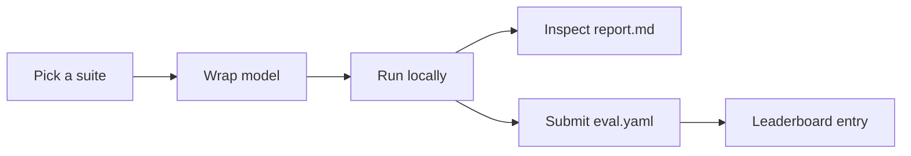

# Start Here: Researcher Workflow

This page connects the docs into one simple flow:

**Domain → Suite → Run → Report → Submit → Leaderboard**



---

## Run a toy benchmark

Use the toy benchmark to verify your wrapper + evaluation pipeline end-to-end.

```bash
pip install -e .
python -m fmbench generate-toy-data
python -m fmbench run --suite SUITE-TOY-CLASS --model configs/model_dummy_classifier.yaml --out results/toy_run
```

Outputs:

- `results/toy_run/report.md`
- `results/toy_run/eval.yaml`

---

## Submit results (the fastest path)

1. Run locally to produce `eval.yaml`.
2. Open a submission issue and **attach your `eval.yaml`** (and optionally `report.md`).

[Open a submission issue](https://github.com/allison-eunse/ai4h-inspired-fm-benchmark-hub/issues/new?template=benchmark_submission.md){ .md-button .md-button--primary }
[Submission guide](contributing/submission_guide.md){ .md-button }

---

## Scenarios (end-to-end examples)

## Suite IDs you can rely on

These suite IDs are guaranteed to exist in this repo (see `python -m fmbench list-suites`):

| Suite ID | What it evaluates | How you run it |
|---|---|---|
| `SUITE-TOY-CLASS` | Toy fMRI-like classification (pipeline sanity check) | `python -m fmbench run --suite SUITE-TOY-CLASS ...` |
| `SUITE-ROBUSTNESS-NEURO` | Neuro robustness probes (dropout/noise/line noise/permutation/shift) | `python -m fmbench run-robustness ...` |
| `SUITE-GEN-CLASS-001` | Genomics classification suite | `python -m fmbench run --suite SUITE-GEN-CLASS-001 ...` |
| `SUITE-NEURO-CLASS-001` | Neurology MRI classification suite | `python -m fmbench run --suite SUITE-NEURO-CLASS-001 ...` |

---

### Scenario A: Evaluate my fMRI(-like) classifier on toy data

- **Step 1 — Generate toy neuro data**:

```bash
python -m fmbench generate-toy-data
```

- **Step 2 — Point `fmbench` at your model** (via a YAML config)

```yaml
# my_model_config.yaml
model_id: my_fmri_model
name: "My fMRI model"
version: "0.1.0"

type: python_class
import_path: "my_model:MyModelWrapper"
```

- **Step 3 — Run the suite**:

```bash
python -m fmbench run --suite SUITE-TOY-CLASS --model my_model_config.yaml --out results/my_fmri_model_toy
```

- **Step 4 — Inspect outputs**: open `report.md`, then submit `eval.yaml`.

---

### Scenario B: Test robustness on neuro time-series (`SUITE-ROBUSTNESS-NEURO`)

```bash
python -m fmbench run-robustness \
  --model my_model_config.yaml \
  --data toy_data/neuro/robustness \
  --out results/my_fmri_model_robustness \
  --probes dropout,noise,line_noise,permutation,shift
```

The resulting `eval.yaml` includes robustness metrics like:

- `dropout_rAUC`, `noise_rAUC`, `line_noise_rAUC`
- `perm_equivariance`
- `shift_rAUC`

---

### Scenario C: Sanity-check a genomics model (`SUITE-GEN-CLASS-001`)

```bash
python -m fmbench generate-toy-data
python -m fmbench run --suite SUITE-GEN-CLASS-001 --model my_model_config.yaml --out results/my_genomics_toy
```

If you don’t see the suite IDs above in `list-suites`, you’re likely not running from the repo root. This should work:

```bash
python -m fmbench list-suites
```

---

### Scenario D (optional): Neurology MRI classification (`SUITE-NEURO-CLASS-001`)

This suite exists and is listed by `fmbench list-suites`, but it expects an MRI dataset (default `DS-ADNI` in `tests/suite_neurology_classification.yaml`).

```bash
python -m fmbench run --suite SUITE-NEURO-CLASS-001 --model my_model_config.yaml --out results/my_mri_run
```

